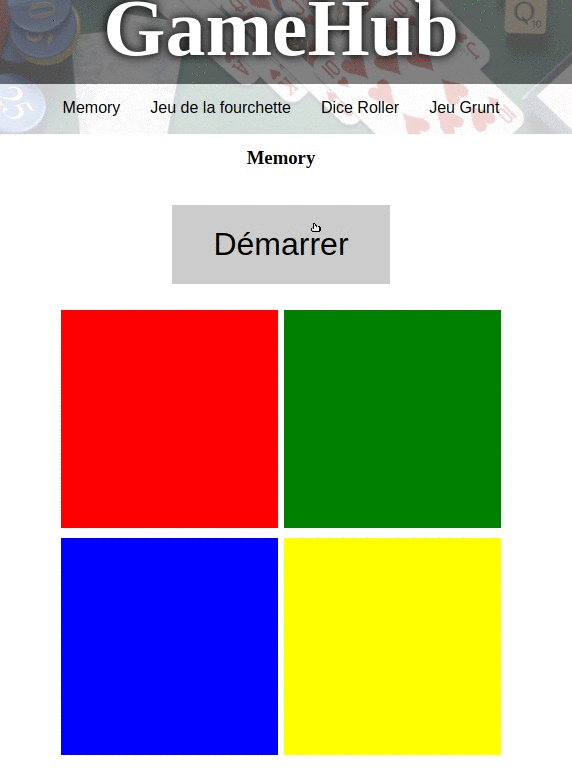
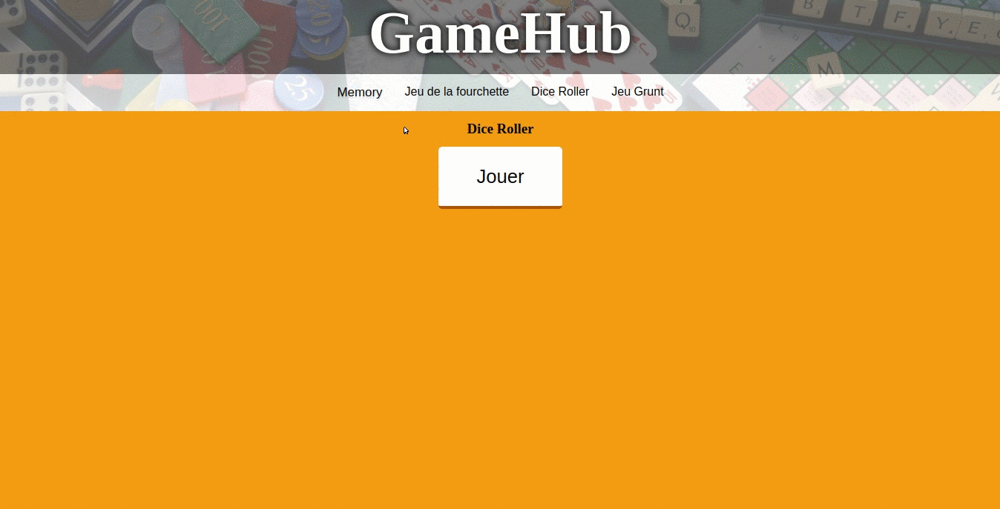
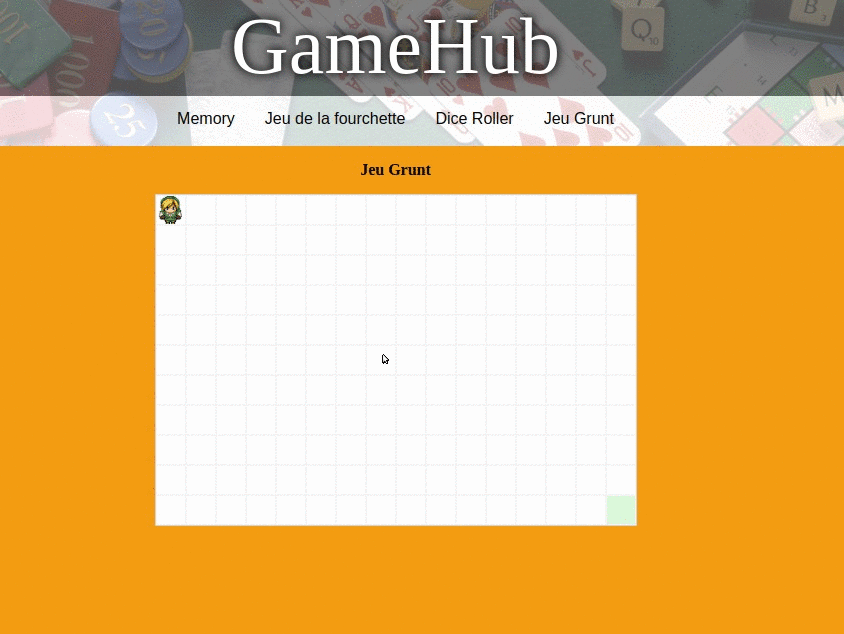

# 2021-S03-GameHub
Several games using JS

## Description
Website to play games such as :
  - Memory game : rememeber animated boxes order
  - Fourchette game : guess a number between [min;max] as few try as possible.
  - Dice Roller : roll dices and be greater than computer
  - RPG : move your figure to reach the endpoint

## How to start ?
Using npm start

## How does it look ?
### Memory

### Dice Roller

### RPG
